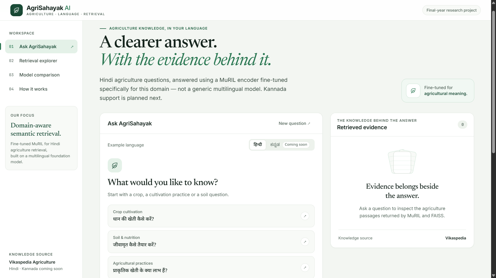
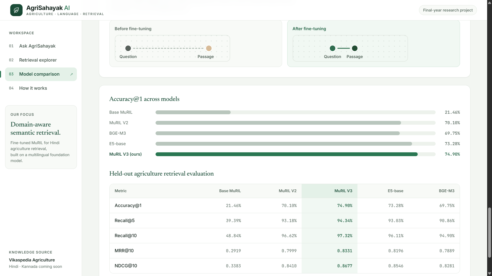
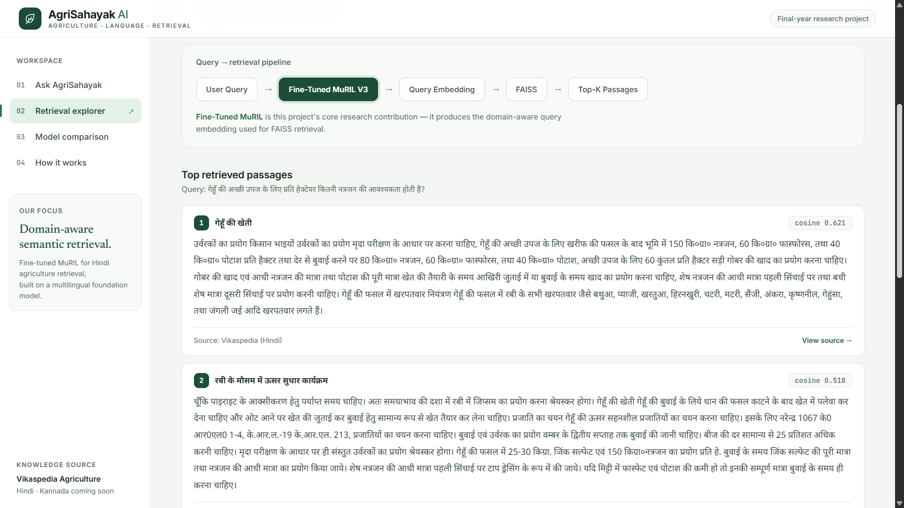
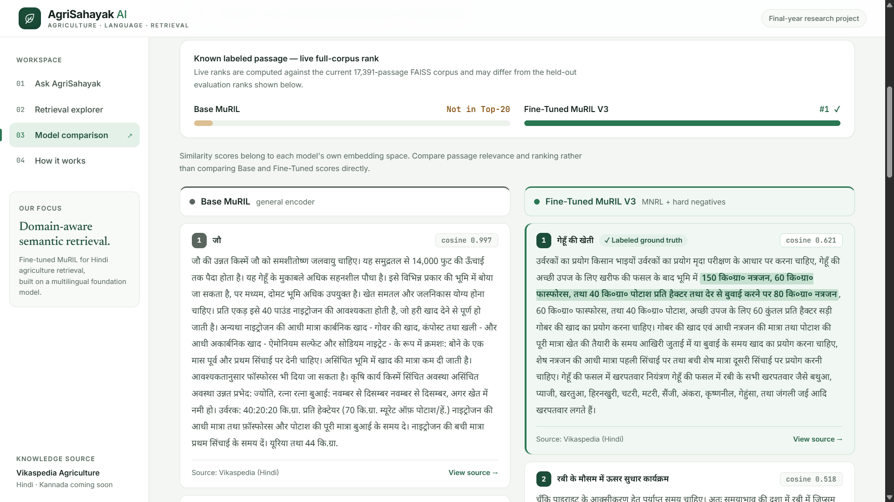

# 🌾 AgriSahayak AI — Agriculture-Aware RAG using Fine-Tuned MuRIL

This project fine-tunes Google's MuRIL model as an agriculture-aware sentence encoder to improve domain-specific semantic retrieval for Indian-language Retrieval-Augmented Generation (RAG). The deployed application is **AgriSahayak AI**.

The current implementation focuses primarily on Hindi agriculture data. The research pipeline uses Fine-Tuned MuRIL V3, FAISS, Gemini API / Local Qwen, FastAPI, and React to retrieve relevant agriculture passages and generate grounded answers.

**Core Focus:** Fine-tuning MuRIL for agriculture-specific semantic retrieval and evaluating its improvement over Base MuRIL and strong multilingual embedding baselines.

**Model on Hugging Face:** [prathameshkoph/agrisahayak-muril-v3](https://huggingface.co/prathameshkoph/agrisahayak-muril-v3) <br>
**Model on Kaggle:** [prathamesh185/agriculture-aware-muril-v3](https://www.kaggle.com/models/prathamesh185/agriculture-aware-muril-v3)<br>



---

## 📑 Table of Contents

- [Highlights](#-highlights)
- [Project Status](#-project-status)
- [Running Locally](#-running-locally)
- [Project Pipeline](#️-project-pipeline)
- [Evaluation](#-evaluation)
- [Fine-Tuning Strategy](#-fine-tuning-strategy)
- [Dataset Validation](#-dataset-validation)
- [Why MuRIL?](#-why-muril)
- [Web Application](#-web-application)
- [API](#-api)
- [Architecture](#️-architecture)
- [Tech Stack](#️-tech-stack)
- [Project Structure](#-project-structure)
- [Future Work](#-future-work)
- [Data Source & Acknowledgments](#-data-source--acknowledgments)
- [License](#-license)

---

## ✨ Highlights

- Agriculture-specific semantic retrieval using Fine-Tuned MuRIL
- Hindi agriculture question–passage dataset from Vikaspedia
- Stage-1 MNRL fine-tuning + Stage-2 hard-negative refinement
- FAISS-based dense retrieval with grounded RAG
- Gemini API / Local Qwen integration
- React + FastAPI web application
- Comparison with Base MuRIL, E5-base, and BGE-M3
- Duplicate and leakage validation

## ✅ Project Status

**Completed**
- [x] Built and validated a Hindi agriculture dataset with 20,141 question–passage pairs
- [x] Fine-tuned MuRIL using MNRL to create MuRIL V2
- [x] Performed hard-negative mining and Stage-2 refinement to create MuRIL V3
- [x] Evaluated Base MuRIL, V2, V3, E5-base, and BGE-M3
- [x] Built FAISS retrieval, RAG pipeline, FastAPI backend, and React frontend
- [x] Added AI Assistant, Retrieval Analysis, and Model Comparison interfaces
- [x] Released the fine-tuned encoder on Hugging Face and Kaggle

**In Progress / Future Work** — see [Future Work](#-future-work)

## 🚀 Running Locally

**Prerequisites:** Python 3.11 recommended · Node.js 18+ · npm · Optional: Ollama for local Qwen inference · Google Gemini API key if using Gemini

1. **Clone the repository**
   ```bash
   git clone https://github.com/Prathamesh185/rag-muril-finetuning.git
   cd rag-muril-finetuning
   ```

2. **Create and activate a Python environment**
   ```bash
   # Windows
   python -m venv venv
   venv\Scripts\activate

   # macOS / Linux
   python3 -m venv venv
   source venv/bin/activate
   ```

3. **Install dependencies**
   ```bash
   pip install -r requirements.txt
   ```

4. **Configure Gemini** — create a `.env` file:
   ```
   GOOGLE_API_KEY=your_google_api_key
   ```
   Do not commit the `.env` file.

5. **Start the FastAPI backend**
   ```bash
   python -m uvicorn api:app --host 127.0.0.1 --port 8000
   ```
   FastAPI docs: `http://127.0.0.1:8000/docs`

6. **Start the React frontend**
   ```bash
   cd frontend
   npm install
   npm run dev
   ```
   Open `http://localhost:5173`

<details>
<summary><strong>🖥️ Local Qwen Setup (optional)</strong></summary>

The project also supports local answer generation using Qwen through Ollama.

```bash
ollama pull qwen3.5:4b
```

Then start Ollama and select **Local Qwen** from the application. Gemini can be used instead when a valid Google API key is configured.

</details>

## 🏗️ Project Pipeline

**Training and Dataset Pipeline**

```
Vikaspedia Hindi Agriculture Articles
        ↓
Data Collection → Cleaning & Preprocessing → Sentence-Based Chunking
        ↓
Question Generation → Question–Passage Dataset
        ↓
Duplicate & Leakage Validation → Train / Validation / Test Split
        ↓
Base MuRIL → Stage-1 Fine-Tuning (MNRL) → Fine-Tuned MuRIL V2
        ↓
Hard-Negative Mining → Cleaning / Quality Review
        ↓
Stage-2 Fine-Tuning (MNRL + Hard Negatives) → Fine-Tuned MuRIL V3
```

**Runtime RAG Pipeline**

> Fine-Tuned MuRIL V3 evaluation is complete. Integration of V3 into the live application FAISS index is currently in progress.

```
User Question → Fine-Tuned MuRIL Encoder → 768-D Query Embedding
        ↓
FAISS Index → Top-K Agriculture Passages → Grounded Context
        ↓
Gemini API / Local Qwen → Hindi Answer + Retrieved Sources
```

<details>
<summary><strong>Base vs Fine-Tuned Retrieval Comparison (diagram)</strong></summary>

```
                    ┌── Base MuRIL ───────→ Base FAISS ───────┐
User Question ──────┤                                         ├──→ Compare Top-K Results
                    └── Fine-Tuned MuRIL ─→ Fine-Tuned FAISS ─┘
```

Both retrieval paths use the same passage corpus and metadata ordering so that the encoder remains the main variable being compared.

</details>

## 📊 Evaluation

All models are evaluated on the same held-out Hindi agriculture retrieval **test set: 1,980 queries, 744 unique passages.**

| Metric | Base MuRIL | Fine-Tuned V2 | **Fine-Tuned V3** | E5-base | BGE-M3 |
|---|---:|---:|---:|---:|---:|
| Accuracy@1 | 0.2146 | 0.7010 | **0.7490** | 0.7328 | 0.6975 |
| Accuracy@10 | 0.4884 | 0.9662 | **0.9732** | 0.9611 | 0.9490 |
| MRR@10 | 0.2919 | 0.7999 | **0.8331** | 0.8196 | 0.7889 |
| nDCG@10 | 0.3383 | 0.8410 | **0.8677** | 0.8546 | 0.8281 |
| MAP@100 | 0.3063 | 0.8013 | **0.8343** | 0.8213 | 0.7911 |

**Fine-Tuned MuRIL V3 achieved the strongest result across all reported metrics on this held-out test set.**



<details>
<summary><strong>Full metrics breakdown (Accuracy@3/@5, Precision@K, Recall@K)</strong></summary>

| Metric | Base MuRIL | Fine-Tuned V2 | Fine-Tuned V3 | E5-base | BGE-M3 |
|---|---:|---:|---:|---:|---:|
| Accuracy@3 | 0.3389 | 0.8803 | 0.9071 | 0.8949 | 0.8631 |
| Accuracy@5 | 0.3939 | 0.9318 | 0.9434 | 0.9303 | 0.9086 |
| Precision@1 | 0.2146 | 0.7010 | 0.7490 | 0.7328 | 0.6975 |
| Precision@3 | 0.1130 | 0.2934 | 0.3024 | 0.2983 | 0.2877 |
| Precision@5 | 0.0788 | 0.1864 | 0.1887 | 0.1861 | 0.1817 |
| Precision@10 | 0.0488 | 0.0966 | 0.0973 | 0.0961 | 0.0949 |
| Recall@1 | 0.2146 | 0.7010 | 0.7490 | 0.7328 | 0.6975 |
| Recall@3 | 0.3389 | 0.8803 | 0.9071 | 0.8949 | 0.8631 |
| Recall@5 | 0.3939 | 0.9318 | 0.9434 | 0.9303 | 0.9086 |
| Recall@10 | 0.4884 | 0.9662 | 0.9732 | 0.9611 | 0.9490 |

</details>

<details>
<summary><strong>V2 → V3 Improvement (hard-negative refinement gains)</strong></summary>

| Metric | V2 | V3 | Improvement |
|---|---:|---:|---:|
| Accuracy@1 | 0.7010 | 0.7490 | +0.0480 |
| Accuracy@3 | 0.8803 | 0.9071 | +0.0268 |
| Accuracy@5 | 0.9318 | 0.9434 | +0.0116 |
| Accuracy@10 | 0.9662 | 0.9732 | +0.0070 |
| MRR@10 | 0.7999 | 0.8331 | +0.0332 |
| nDCG@10 | 0.8410 | 0.8677 | +0.0268 |
| MAP@100 | 0.8013 | 0.8343 | +0.0330 |

**Key result:** Accuracy@1 improved from **70.10% → 74.90%**. The Stage-2 hard-negative refinement improved both top-rank accuracy and overall retrieval ranking quality.

</details>

> **Note:** Cosine similarity scores are model-specific. Compare rankings across different embedding models rather than raw similarity scores directly.

## 🧠 Fine-Tuning Strategy

**Stage 1 — MuRIL V2:** fine-tunes MuRIL using agriculture question–positive passage pairs with Multiple Negatives Ranking Loss.

**Stage 2 — Hard-Negative Refinement:** Fine-Tuned MuRIL V2 retrieves difficult but incorrect passages from the training corpus. Candidates are filtered to remove positives, same-document/duplicate-group candidates, and near-duplicates. Initial mining produced 30,597 triplets; after cleaning, 30,585 remained. Stage-2 training starts from the Stage-1 model.

<details>
<summary><strong>Full hyperparameter tables (Stage 1 & Stage 2)</strong></summary>

**Stage 1**

| Setting | Value |
|---|---|
| Base model | google/muril-base-cased |
| Objective | Multiple Negatives Ranking Loss |
| Epochs | 3 |
| Learning rate | 2e-5 |
| Max sequence length | 256 |
| Embedding dimension | 768 |
| Training pairs | 16,292 |
| Validation pairs | 1,869 |

**Stage 2**

| Setting | Value |
|---|---|
| Starting model | Fine-Tuned MuRIL V2 |
| Objective | MNRL with explicit hard negatives |
| Epochs | 1 |
| Batch size | 32 |
| Learning rate | 1e-5 |
| Max sequence length | 256 |
| Training triplets | 30,585 |
| Validation pairs | 1,869 |
| Selected checkpoint | Step 478 |

</details>

**Why hard negatives?** Random or in-batch negatives become too easy for an already fine-tuned retriever. Hard negatives are semantically similar to the query and retrieved highly by the current model, but still incorrect — training on these encourages finer semantic distinctions. This matters especially in agriculture, where passages share overlapping terminology (crops, fertilizers, irrigation, diseases, soil conditions).

## 🧹 Dataset Validation

<details>
<summary><strong>Validation checks and final dataset composition</strong></summary>

Checked for: exact/near-duplicate documents, exact/near-duplicate questions, question-to-passage copying, train/validation/test leakage, and duplicate-document grouping across splits.

**Final Dataset**
- 20,141 question–passage pairs
- 7,379 unique chunks
- 1,814 documents
- 1,770 split groups

**Split:** Train 16,292 · Validation 1,869 · Test 1,980

The held-out test split remained unchanged during Stage-2 hard-negative training.

</details>

## 🧠 Why MuRIL?

MuRIL was selected because it was specifically developed for Indian languages and supports multilingual and transliterated Indian-language text. The goal isn't to use MuRIL directly, but to adapt it to the agriculture domain so relevant passages rank more accurately for user queries: **Base MuRIL → Domain Fine-Tuning → MuRIL V2 → Hard-Negative Refinement → MuRIL V3.**

## 🌐 Web Application

**AgriSahayak AI** has four main interfaces:

1. **Ask AgriSahayak** — ask agriculture questions in Hindi, get grounded answers with retrieved evidence passages, cosine similarity scores, and sources. Choose between Gemini API or Local Qwen (via Ollama).

2. **Retrieval Explorer** — shows the retrieval pipeline (Query → Fine-Tuned MuRIL V3 → Query Embedding → FAISS → Top-K Passages) before LLM generation, with each retrieved passage's cosine score and source.

   

3. **Model Comparison** — runs the same question through Base MuRIL and Fine-Tuned MuRIL V3 side by side, making the fine-tuning effect directly visible: the labeled ground-truth passage often doesn't even appear in Base MuRIL's top-20, while Fine-Tuned V3 ranks it #1.

   

4. **How It Works** — an explainer view walking through why fine-tuning helps (how hard-negative training reshapes the embedding space) and the full offline build / online query pipeline, for readers who want the system explained rather than demonstrated live.

> **Note on corpus size:** the live application indexes a **17,391-passage FAISS corpus**, larger than the 744-passage held-out evaluation set used for the benchmark numbers above. The two are separate by design — evaluation uses a fixed, leakage-checked subset, while the live app searches the full indexed corpus.

## 🔌 API

The React frontend communicates with the Python backend through a FastAPI REST API.

| Endpoint | Purpose |
|---|---|
| `GET /api/health` | Backend health check |
| `POST /api/chat` | Retrieve evidence and generate a grounded answer |
| `POST /api/retrieve` | Fine-Tuned MuRIL retrieval only |
| `POST /api/compare` | Base MuRIL vs Fine-Tuned MuRIL comparison |

<details>
<summary><strong>Example: POST /api/chat (request & response)</strong></summary>

**Request**
```json
{
  "question": "गेहूं को पानी कब दें?",
  "model_choice": "Gemini API"
}
```

**Response**
```json
{
  "answer": "...",
  "retrieved": [
    {
      "rank": 1,
      "score": 0.78,
      "chunk_id": "...",
      "document_id": "...",
      "title": "...",
      "text": "...",
      "source": "...",
      "url": "..."
    }
  ]
}
```

</details>

## 🏛️ Architecture

```
React + Vite Frontend → REST / JSON → FastAPI Backend
        ↓
RAG Pipeline → Fine-Tuned MuRIL + FAISS → Retrieved Agriculture Context
        ↓
Gemini API / Local Qwen → Grounded Hindi Answer
```

## 🛠️ Tech Stack

AI/ML: Python, PyTorch, Hugging Face Transformers, Sentence Transformers, Google MuRIL, FAISS · Generation: Google Gemini API, Qwen (Ollama) · Backend: FastAPI, Uvicorn · Frontend: React, Vite

<details>
<summary><strong>Full tech stack (data processing, dev tools, fallback UI)</strong></summary>

- **Data Processing:** Pandas, NumPy, PyMuPDF, BeautifulSoup
- **Training & Evaluation:** Hugging Face Datasets, Sentence Transformers evaluation utilities, scikit-learn, FAISS
- **Development Tools:** Git, GitHub, VS Code, Kaggle, Jupyter Notebook
- **Legacy / Fallback Interface:** Gradio

</details>

## 📂 Project Structure

<details>
<summary><strong>Click to expand full project structure</strong></summary>

```
rag-muril-finetuning/
│
├── api.py
├── app.py
├── requirements.txt
├── README.md
│
├── frontend/
│   ├── package.json
│   ├── vite.config.js
│   └── src/
│       ├── App.jsx
│       └── api/
│           └── client.js
│
├── rag/
│   ├── config.py
│   ├── retriever.py
│   ├── base_retriever.py
│   ├── pipeline.py
│   ├── llm.py
│   ├── pdf_loader.py
│   ├── build_faiss_index.py
│   └── build_base_faiss_index.py
│
├── data/
│   ├── chunks/
│   ├── cleaned/
│   ├── cleaned_v2/
│   ├── training/
│   ├── training_v2/
│   ├── validation/
│   ├── validation_v2/
│   └── index/
│       ├── finetuned.faiss
│       ├── base.faiss
│       └── finetuned_metadata.csv
│
├── models/
│   ├── base_muril/
│   ├── fine_tuned_muril_v2/
│   └── fine_tuned_muril_v3/
│
├── scripts/
│   ├── scraping/
│   ├── preprocessing/
│   ├── cleaning/
│   ├── question_generation/
│   ├── training/
│   │   ├── mine_hard_negatives_v2.py
│   │   ├── clean_hard_negatives_v2.py
│   │   └── train_muril_v3_hardneg_mnrl.py
│   ├── validation/
│   └── evaluation/
│
└── evaluation/
    ├── output/
    └── output_v2/
```

Model weights are kept outside normal Git tracking because trained SentenceTransformer checkpoints are large.

</details>

## 🎯 Future Work

- Extend the system to Kannada and additional Indian languages
- Build an independent external agriculture retrieval benchmark
- Explore Triplet Loss and other contrastive objectives
- Study cross-lingual retrieval behavior
- Improve robustness to spelling variation and transliteration
- Publicly deploy the complete application

## 📚 Data Source & Acknowledgments

- Hindi agriculture content sourced from Vikaspedia
- Encoder built on MuRIL — Multilingual Representations for Indian Languages
- Answer generation using Google Gemini API and Qwen (via Ollama)
- Built using Sentence Transformers; dense retrieval using FAISS

## 📄 License

This project is developed for academic and research purposes.